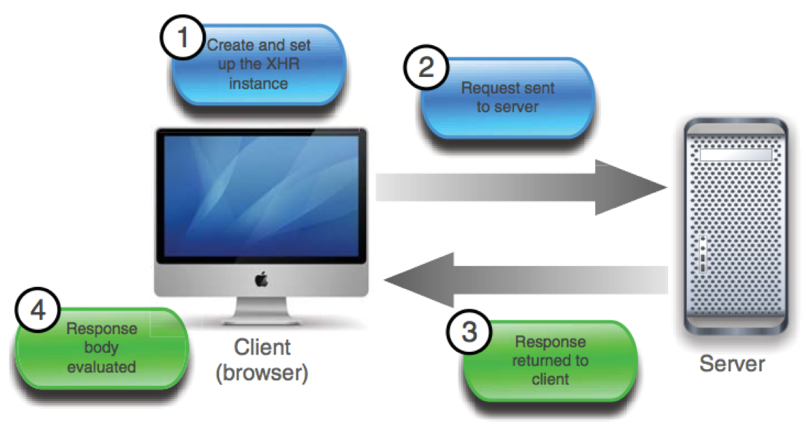

## Présentation de l'UE Web2
### Modalités d'évaluation
* Projet 
* Contrôle terminal 1h30

### Intervenantes
- Blandine Descamps &lt;blandine.descamps AT ling.fr&gt;
- Caroline Desprat &lt;caroline.desprat AT irit.fr&gt;
Bureau GS204

---

### Outils de développement
- IDE JavaScript (Visual Studio Code, WebStorm)
- Terminal : Git, npm, node

### Cours de l'UE
1. JQuery (aujourd'hui)
2. Bootstrap - LESS
3. Angular 1.*
4. React/redux
5. Node.JS


# JQuery
##Plan du cours
* Présentation de JQuery
* Hello world ! en JQuery
* Selecteurs en JQuery
* Manipulation du DOM avec JQuery
* Binding des événements avec JQuery
* Ajax
    * Rappels en JS
    * Ajax en JQuery
        * GET et POST
    * Ajax en JQuery avec des données JSON
       * GET et POST

---

## Présentation de JQuery
<div class="centered">


</div>

JQuery (2006) est une bibliothèque JavaScript (JS)

* But
    - Moins verbeux que JS
    - Surcouche pour améliorer l'interopérabilité

* Avantages :
    - Documentation officielle de qualité
    - Large communauté de contributeurs 
    - Supportée par des acteurs du Web de premier plan (Google, Amazon, Twitter, Mozilla, Microsoft ...)
    - Beaucoup de plug-ins ! 


## Exemple : Hello World !

```html
<!DOCTYPE html>
<html>
<head>
	<title>Hello, World!</title>
</head>
<body>
	<div>
		<p id="hello">Some random text</p>
	</div>
	


</body>
</html>
```


## Exemple : Hello World !

```html
<!DOCTYPE html>
<html>
<head>
	<title>Hello, World!</title>
</head>
<body>
	<div>
		<p id="hello">Some random text</p>
	</div>
	<script src="https://code.jquery.com/jquery-3.3.1.min.js"></script>
	<script>
	


	</script>	
</body>
</html>
```

## Exemple : Hello World !

```html
<!DOCTYPE html>
<html>
<head>
	<title>Hello, World!</title>
</head>
<body>
	<div>
		<p id="hello">Some random text</p>
	</div>
	<script src="https://code.jquery.com/jquery-3.3.1.min.js"></script>
	<script>        
		$(document).ready(function() {           
			      
		});
	</script>
</body>
</html>
```

## Exemple : Hello World !

```html
<!DOCTYPE html>
<html>
<head>
	<title>Hello, World!</title>
</head>
<body>
	<div>
		<p id="hello">Some random text</p>
	</div>
	<script src="https://code.jquery.com/jquery-3.3.1.min.js"></script>
	<script>        
		$(document).ready(function() {             
			$('#hello').text('Hello, World!');        
		});
	</script>
</body>
</html>
```

## Explications du code 1/3

1 . Chargement de la bibliothèque à partir du CDN :

```js
<script src="https://code.jquery.com/jquery-3.3.1.min.js"></script>
```

Ce code introduit la variable global **`$`**, alias de la fonction et du namespace `JQuery`


## Explications du code 2/3

2 . La fonction ci dessous permet d'éxécuter le code quand le **DOM** (Document Object Model) est détecté comme 'prêt' (ready)


```js
// Quand le `document` est `ready`, éxécuter telle fonction `...`
$(document).ready(function(){ ... });

// La version courte version (même comportement qu'au dessus)
$(function(){ ... });
```


**Rappel en JS**

```js
document.addEventListener('DOMContentLoaded', function(){ ... }, false);
// ou 
window.addEventListener('load',function(){ ... },false);
```


## Explications du code 3/3

3 . Une fois le DOM `ready`, JQuery éxécute le callback :
1. Récupérer l'élément dont l'attribut `id` est égal à `hello` (`#hello`).
2. Mettre le `text()` dans l'élément selectionné à `Hello, World` 

```js
// Passer un `selecteur` à `$` jQuery, retourne notre élément
// Définir le Text de l élément

$('#hello').text('Hello, World!');
```


**Rappel en JS**

```js
document.querySelector('#hello').innerHTML = 'Hello, World!';
```


##Rappels sélecteurs

* type : utiliser le nom du tag `div`


* identifiant : précéder le nom de la classe avec un dièse `#monId`


* classe : précéder le nom de la classe avec un point `.maClasse`


* attribut : nom de l'attribut recherché entre crochets `[attr]` `[attr=valeur]`


* combinaison : 
	* `.maClasse > p` : les enfants directs paragraphe de .maClasse
	* `p .maClasse`: les descendants .maClasse des paragraphes
	* `p.maClasse` : les paragraphes de classe maClasse
	* `p , maClasse` : les paragraphes et les éléments de classe maClasse


Récupération d'un pseudo tableau

```js
var divTab =$("#myDiv"); //récupère l'objet jQuery avec le résultat de l'id séléctionné
var div =divTab[0]; //permet d'accéder à une pseudo tableau a partir de la structure 
//retournée par l'objet JQuery pour obtenir l'élément DOM
```


##Modèle événementiel de JQuery
 Attacher un event handler

```js
$(document).ready(
	function(){
		//cacher la div #toggleDiv
		$("#toggleDiv").hide();


	});
```

##Modèle événementiel de JQuery
 Attacher un event handler

```js
$(document).ready(
	function(){
		//cacher la div #toggleDiv
		$("#toggleDiv").hide();
		//ajout d'un event handler sur le bouton au clic
		$("button").click(function(){ 
			

		});
	});
```

##Modèle événementiel de JQuery
 Attacher un event handler

```js
$(document).ready(
	function(){
		//cacher la div #toggleDiv
		$("#toggleDiv").hide();
		//ajout d'un event handler sur le bouton au clic
		$("button").click(function(){ 
			//montrer la div #toggleDiv
			$("#toggleDiv").show();
		});
	});
```

#Le DOM (Document Object Model)

##Manipulation du DOM 1/2

* Créer des éléments du DOM
```js
var myLink =$('<a href="http://stackexchange.com"></a>');
```

* Insertion d'éléments à **l'intérieur** d'un élément existant
```js
$('a').prepend('Lien : '); // inserer AVANT
$('h1:first').prepend('Premier titre : ');// inserer AVANT
$('q').append(" (c'était une citation)");//inserer APRES
$('#titre').append($('#sommaire'));//inserer APRES
```


* Insertion d'éléments à **l'exterieur** d'un élément existant
```js
$('#titre').insertBefore('h1:first'); 
$('h1:first').insertAfter($('#titre'));
//Ces méthodes renvoient les objets une fois placés dans le document
```


## Manipulation du DOM 2/2
* Cloner un élément

```js
// Multiplie le nombre de boutons par 2.
$('button').clone().appendTo($('body'));
// Revient à faire :
$('body').append($('button').clone());
```

* Supprimer un élément

```js
// Supprime les liens de la page ayant la classe "sites".
$('a').remove('.sites');
// Supprime les balises <strong> dans des <button>.
$('button strong').remove();
```


* Vider un élément

```js
$('body').empty(); // Vide la page web.
// Revient à faire : $('body').html('');
```


##Manipulation du DOM avancée avec JQuery

JQuery possède des fonctions qui peuvent faciliter la manipulation du DOM (peut être coûteux en ressources)

* `$.trim(value)`: suppression des espaces au début et à la fin d'une chaîne.


* `$.each(container, callback)`: itère sur les items d'un container, invoquant le callback passé pour chacun des items.


* `$.map(array,callback)`: itère sur l'array passé en paramètre, invoquant le callback passé pour chacun des item et récupérant les valeurs retournées par la fonction dans un nouvel array.


* `$.inArray(value,array)`: retourne l'index de la position de la première occurrence de la valeur passée.

#AJAX et JQuery

##Rappels AJAX

**AJAX** (Asynchronous JavaScript and XML) pour des interactions *asynchrones* entre le client et le serveur

<div class="centered">



</div>

1. Créer l'instance XHR 
2. Initialiser la requête 
3. Regarder la progression de la requête
4. Traiter la réponse


##Rappel AJAX en JS (simplifié)

```js
//Créer l'objet XMLHttpRequest 
var xhr = new XMLHttpRequest(); 
// ouvre la liaison avec le serveur


// executée à chaque changement d'état de la réponse


// envoie de la requete avec params (généralement null)
 
```


##Rappel AJAX en JS (simplifié)

```js
//Créer l'objet XMLHttpRequest 
var xhr = new XMLHttpRequest(); 
// ouvre la liaison avec le serveur
xhr.open(HttpMethod, url, type_connex);

// executée à chaque changement d'état de la réponse


// envoie de la requete avec params (généralement null)

```


##Rappel AJAX en JS (simplifié)

```js
//Créer l'objet XMLHttpRequest 
var xhr = new XMLHttpRequest(); 
// ouvre la liaison avec le serveur
xhr.open(HttpMethod, url, type_connex);

// executée à chaque changement d'état de la réponse
xhr.onreadystatechange= function(){
	if (req.readyState == 4 && req.status == 200) {
		//des données ont ete recupérées
	}else{
		//pas de données
	}
}; 

// envoie de la requete avec params (généralement null)

```


##Rappel AJAX en JS (simplifié)

```js
//Créer l'objet XMLHttpRequest 
var xhr = new XMLHttpRequest(); 
// ouvre la liaison avec le serveur
xhr.open(HttpMethod, url, type_connex);

// executée à chaque changement d'état de la réponse
xhr.onreadystatechange= function(){
	if (req.readyState == 4 && req.status == 200) {
		//des données ont ete recupérées
	}else{
		//pas de données
	}
}; 

// envoie de la requete avec params (généralement null)
xhr.send(params);
```

##Rappel AJAX en JS 
###Détail des paramètres

* `HttpMethod` : 
	* GET :demande de données au serveur
	* POST : transmettre des données (methode `send`)
	* HEAD: en-tête des fichiers
	* DELETE/PUT

* `url` : url du script effectuant le traitement


* `type_connex`:
	* `true` : asynchrone
	* `false` : synchrone (la fonction associée à onreadystatechange est executée directement après, pas besoin de la spécifier)


##Ajax JQuery - Présentation de l'objet

```js
$.ajax({    
	type : { POST or GET or PUT etc.},    
	url : {server.url}, 
	data:{someData:true},    
	statusCode : { ... }
})


  ;
```


##Ajax JQuery - Présentation de l'objet

```js
$.ajax({    
	type : { POST or GET or PUT etc.},    
	url : {server.url}, 
	data:{someData:true},    
	statusCode : { ... }
})
.done(function(data){ //succes de la requete
	alert(data); 
})


  ;
```


##Ajax JQuery - Présentation de l'objet

```js
$.ajax({    
	type : { POST or GET or PUT etc.},    
	url : {server.url}, 
	data:{someData:true},    
	statusCode : { ... }
})
.done(function(data){ //succes de la requete
	alert(data); 
})
.fail(function(jqXHR, textStatus){//echec de la requete
	alert('Error occurred: '+ textStatus);
})


  ;
```


##Ajax JQuery - Présentation de l'objet

```js
$.ajax({    
	type : { POST or GET or PUT etc.},    
	url : {server.url}, 
	data:{someData:true},    
	statusCode : { ... }
})
.done(function(data){ //succes de la requete
	alert(data); 
})
.fail(function(jqXHR, textStatus){//echec de la requete
	alert('Error occurred: '+ textStatus);
})
.always(function(jqXHR, textStatus){
	alert('Ajax request was finished')
});
```


##Ajax GET JQuery 

```js
$.get(URL,callback);
```


3 exemples de syntaxe possible :

```js
$.get('url.html',function(data){$('#update-box').html(data);});
```

```js
$.ajax({     
	type:'GET',     
	url:'url.php',
}).done(function(data){
	$('#update-box').html(data);
}).fail(function(jqXHR, textStatus){
	alert('Error occurred: '+ textStatus);
});
```

```js
$('#update-box').load('url.php',{data:"something"});
```


##Ajax POST JQuery

```js
$.post(URL,data,callback);
```

2 exemples de syntaxe possible :

```js
$.post('url.php',
	{date1Name: "data1Value", date2Name: "data2Value"},//data to be posted
	function(data){
		$('#update-box').html(data);
	});
```

```js
$.ajax({    
	type:'Post',
	url:'url.php',
	data:{date1Name: "data1Value", date2Name: "data2Value"}//data to be posted
}).done(function(data){
	$('#update-box').html(data);
});
```

#JSON
##JSON - Rappels
JSON : JavaScript Object Notation

Format léger d'échange de données. Dérivé de la notation des objets de JavaScript.

* Structure : 
	* Ensemble de paires clés / valeurs
	* Listes ordonnées de valeurs
* Types de données : 
	* Objets
	* Tableaux
	* Valeurs génériques (tableau, objet, booléen, nombre, chaine, null)
	
---

###Exemple de JSON :

```js
{
	books:[
		{
			title:"AJAX et PHP : Comment construire des applications web réactives",
			isbn:"978-2100506842"
		},
		{
			title:"Pratique de MySQL et PHP",
			isbn:"978-2100523368"
		},
		{
			title:"Tout sur le web 2.0 et 3.0, 2e édition",
			isbn:"978-2100543427 »
		}
	]
}
```

---

###Ajax POST JSON
```js
var postData = {
	Name:"name",    
	Address: "address",    
	Phone: "phone"};
	
$.ajax({     
	type:"POST",     
	url:"url.php",     
	dataType:"json",
	data: JSON.stringfy(postData) //attention à bien serialiser  
}).done(function(data){
		//ici la variable data est en JSON
		//JSON.parse(data)
});
```

---

###Ajax GET JSON
```js
$.getJSON('url.php',function(data){
	//ici la variable data est en JSON
});
```
```js	
$.ajax({      
	type:"Get",      
	url:"url.php",      
	dataType:"json",
}).done(function(data){
		//ici la variable data est en JSON
		//JSON.parse(data)
});
```

#Ressources

---

- [JQuery API Documentation](http://api.jquery.com/)
- [jQuery for Professionals](http://books.goalkicker.com/jQueryBook/jQueryNotesForProfessionals.pdf)
- [OpenClassRoom JQuery](https://openclassrooms.com/courses/jquery-ecrivez-moins-pour-faire-plus)