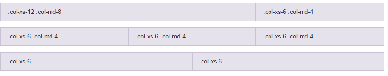

#Plan du cours

1. Qu'est ce qu'un framework (front end/css)?

2. Bootstrap

3. LESS

##Qu'est ce qu'un framework?

###Framework ou cadriciel :  

> " Un ensemble cohérent de composants logiciels structurels, 
> qui sert à créer les fondations ainsi que les grandes lignes 
> de tout ou d’une partie d'un logiciel "
*[Wikipedia](https://fr.wikipedia.org/wiki/Framework)*


<center>Un framework se différencie d'une bibliothèque par sa nature générique</center>
<br>

##Qu'est ce qu'un framework?

### Un framework permet de

  - Structurer l'architecture logicielle
      * Pattern (patron de conception) MVC (Modèle Vue Controleur), interactions avec le SGBD, ...
  - Faciliter le développement de tâches récurrentes
    * Tâches récurrentes pré programmées
  - Rendre générique une application
      * Spécialisation de classes du framework
      
      
## Framework front end
Côté client: interface, gestion des interactions (HTML, CSS, JS)

* La base : typographie, aspects généraux 

* le layout : zones principales de l'architecture de la page (en-tête, menu, contenu principal, pied de page) -> facilement manipulable

* les modules : objets composant les zones de layout (liste, bouton, formulaire, slider...) -> couvrant les besoins courants

* les états des modules : montré/ caché, hover, actif/inactif, focus... -> standards

* comportements interactifs : menus animés, carrousel, onglets interactifs, verification de formulaire -> gestion facilitée


## Responsive design 

(ou conception de sites web adaptifs) :

  * L'affichage s'adapte à la taille de l'écran (répond aux changement de largeur et de hauteur de la page) -> paramétrable
  
  * Différent de *adaptive design* : l'affichage du contenu et parfois le contenu lui même change en fonction de l'appareil utilisé (ex: plus de photos sur smartphones, reduction des menus ...)
  
## Bootstrap


Créé par Twitter (2011). Framework CSS open-source permettant de faciliter la création de page HTML **responsive**

* Principe de grille responsive, styles CSS prédéfinis pour tous les éléments HTML
    + Faciliter l'organisation et l'aspect des pages
* Composant JS prédéfinis (liste déroulantes dynamiques, carrousel)
* Police avec set d'icones (vectorielles)
* Multi navigateur (Desktop et mobile) -> apparence uniforme et standardisation des éléments graphiques

Documentation v3 : https://getbootstrap.com/docs/3.3/ 

## Bootstrap - Exemple de thème 

<center>

</center>

https://getbootstrap.com/examples/theme/

## Bootstrap - Fonctionnement 

*Remarque : ce cours s'appuie sur la version 3 de Bootstrap *

Utilisation d'une série de feuilles de styles **LESS** (*à partir de la version 4 SASS*) qui implémentent différents composants : 

* Une feuille de style principale englobe les feuilles de styles des composants

Le système de grille et le style adaptatif sont standardisés sur une grille de 940 pixels de large par défaut. 

* Quatre variations (différents formats et supports) : 
  
    * téléphones (portrait et paysage), 
    * tablette et PC (haute et basse résolution). 

## Bootstrap - Système de grille
Principe : Système de grille à 12 colonnes et des lignes. 
Dans `col-md-*` l'étoile indique le nombre de colonnes que prend le bloc dans la page.

```html
<!--HTML-->
<taghtml class="col-md-*">contenu</taghtml>
```

<center>

</center>


## Bootstrap - Système adaptatif
Quatre classes pour s'adapter à tout les appareils. Dans `col-*-5` l'étoile indique la taille d'appareil. Permet de créer des layouts adaptés à chaque medium, plus flexible.

* `xs` (for phones - screens less than 768px wide)
* `sm` (for tablets - screens equal to or greater than 768px wide)
* `md` (for small laptops - screens equal to or greater than 992px wide)
* `lg` (for laptops and desktops - screens equal to or greater than 1200px wide)

```html
<!--HTML-->
<taghtml class="col-*-5">contenu</taghtml>
```

<center>

</center>

## Bootstrap - Comportement des composants responsive
Comportements déjà implémentés  grâce aux "responsives breakpoints"
<center>

</center>

<sub><sup>* gutter = goutière : espace entre les composants

## Bootstrap - Autres notions

###Containers

Deux types de containers dans bootstrap:

* La classe `.container` fournit un container adaptatif de taille fixe
* La classe `.container-fluid` fournit un container qui prend toute la largeur du viewport (étendu)

###Row
La classe `row` permet wrapper des colonnes ensemble (une ligne dans la grille).

<center>


source :[OpenClassRoom](https://openclassrooms.com/courses/prenez-en-main-bootstrap/une-grille)
</center>

## Bootstrap - Exemple
<div class="small">
```html
<div class="jumbotron">
  <h1>Jumbotron heading</h1>
  <p class="lead">Cras justo odio, dapibus ac facilisis in, egestas eget quam. Fusce dapibus, tellus ac cursus commodo, tortor mauris condimentum nibh, ut fermentum massa justo sit amet risus.</p>
  <p><a class="btn btn-lg btn-success" href="#" role="button">Sign up today</a></p>
</div>

<div class="row marketing">
  <div class="col-lg-6">
    <h4>Subheading</h4>
    <p>Donec id elit non mi porta gravida at eget metus. Maecenas faucibus mollis interdum.</p>

    <h4>Subheading</h4>
    <p>Morbi leo risus, porta ac consectetur ac, vestibulum at eros. Cras mattis consectetur purus sit amet fermentum.</p>

    <h4>Subheading</h4>
    <p>Maecenas sed diam eget risus varius blandit sit amet non magna.</p>
  </div>

  <div class="col-lg-6">
    <h4>Subheading</h4>
    <p>Donec id elit non mi porta gravida at eget metus. Maecenas faucibus mollis interdum.</p>

    <h4>Subheading</h4>
    <p>Morbi leo risus, porta ac consectetur ac, vestibulum at eros. Cras mattis consectetur purus sit amet fermentum.</p>

    <h4>Subheading</h4>
    <p>Maecenas sed diam eget risus varius blandit sit amet non magna.</p>
  </div>
</div>
```
</div>

## Bootstrap - Exemple
<center>

</center>


## Bootstrap - Mise en place
<div class="small">
```html
<!DOCTYPE html>
<html lang="en">
  <head>
    <meta charset="utf-8">
    <meta http-equiv="X-UA-Compatible" content="IE=edge">
    <meta name="viewport" content="width=device-width, initial-scale=1">
    <!-- The above 3 meta tags *must* come first in the head; any other head content must come *after* these tags -->
    <meta name="description" content="">
    <meta name="author" content="">
    <link rel="icon" href="../../favicon.ico">

    <title>My first bootstrap page</title>
    
    <!-- Latest compiled and minified CSS -->
    <link rel="stylesheet" href="https://maxcdn.bootstrapcdn.com/bootstrap/3.3.7/css/bootstrap.min.css">
    <!-- jQuery library -->
    <script src="https://ajax.googleapis.com/ajax/libs/jquery/3.3.1/jquery.min.js"></script>
    <!-- Latest compiled JavaScript -->
    <script src="https://maxcdn.bootstrapcdn.com/bootstrap/3.3.7/js/bootstrap.min.js"></script>
  </head>
  <body>
    <h1>Hello World !</h1>
    
  </body>
</html>
```
</div>

## Bootstrap - Quelques composants (1/3)

Dropdown Menu

<div class="medium">
```html
<div class="dropdown">
  <button class="btn btn-default dropdown-toggle" type="button" id="dropdownMenu1" data-toggle="dropdown" aria-haspopup="true" aria-expanded="true">
    Dropdown
    <span class="caret"></span>
  </button>
  <ul class="dropdown-menu" aria-labelledby="dropdownMenu1">
    <li><a href="#">Action</a></li>
    <li><a href="#">Another action</a></li>
    <li><a href="#">Something else here</a></li>
    <li role="separator" class="divider"></li>
    <li><a href="#">Separated link</a></li>
  </ul>
</div>
```
</div>
<center>

</center>

## Bootstrap - Quelques composants (2/3)

Jumbotron

```html
      <div class="jumbotron">
        <h1>Jumbotron heading</h1>
        <p class="lead">Cras justo odio, dapibus ac facilisis in, egestas eget quam. Fusce dapibus, tellus ac cursus commodo, tortor mauris condimentum nibh, ut fermentum massa justo sit amet risus.</p>
        <p><a class="btn btn-lg btn-success" href="#" role="button">Sign up today</a></p>
      </div>
```

<center>

</center>

## Bootstrap - Quelques composants (3/3)
Navbar https://getbootstrap.com/docs/3.3/components/#navbar-default

<center>

</center>

Modals https://getbootstrap.com/docs/3.3/components/#modals

<center>

</center>

Carousel https://getbootstrap.com/docs/3.3/components/#carousel

<center>

</center>

#LESS

## LESS - Présentation
<center>

</center>
<br>

* Framework permettant d'organiser et de rendre générique les fichiers CSS
    * Permet l'imbrication des définitions CSS
    * Permet l'utilisation de variables
    * Permet l'utilisation de fonctions (calcul)

LESS est un framework qui doit se **"compiler"** pour générer du CSS interprétable par les navigateurs : c'est un pré-processeur de CSS qui étend les fonctionnalités de CSS.

Documentation http://lesscss.org/ 

Aperçu de l'outil : http://lesscss.org/less-preview/ 

## LESS - Mise en place

```html
<!-- Dans la balise head du fichier HTML -->
<link rel="stylesheet/less" type="text/css" href="styles.less" />
<script src="https://cdnjs.cloudflare.com/ajax/libs/less.js/2.7.3/less.js" type="text/javascript"></script>
```
## LESS - Les variables

* Variables : plus facile pour maintenir le CSS

<div class="column-left">
```css
/*LESS*/
@nice-blue: #5B83AD;
@light-blue: @nice-blue + #111;
#header{
  color: @ligth-blue;
}
```
</div>

<div class="column-right">
```css
/*CSS résultat*/
#header{
  color: #6c94be;
}
```
</div>
<div style="clear:both;"></div>

## LESS - Les mixins
* Mixin ("mixing in") : inclusion de propriétés d'un ensemble de règles dans un autre.

Exemple de (ré)-Utilisation des règles de `.bordered` dans `#menu a` et `.post a` :

<div class="column-left">
```css
/*LESS*/
.bordered {
  border-top: dotted 1px black;
  border-bottom: solid 2px black;
}
#menu a {
  color: #111;
  .bordered;
}
.post a {
  color: red;
  .bordered;
}
```
</div>
<div class="column-right">
```css
/*CSS résultat*/
#menu a {
  color: #111;
  border-top: dotted 1px black;
  border-bottom: solid 2px black;
}
.post a {
  color: red;
  border-top: dotted 1px black;
  border-bottom: solid 2px black;
}
```
</div>


## LESS - Régles imbriquées (nested rules) 1/2
Permet d'imbriquer et/ou de combiner les régles en cascade.

<div class="column-left">
```css
/*LESS*/
#header {
  color: black;
  .navigation {
    font-size: 12px;
  }
  .logo {
    width: 300px;
  }
}
```
</div>
<div class="column-right">
```css
/*CSS résultat*/
#header {
  color: black;
}
#header .navigation {
  font-size: 12px;
}
#header .logo {
  width: 300px;
}
```
</div>

## LESS - Régles imbriquées (Directives and Bubbling) 2/2
Permet d'imbriquer et/ou de combiner les directives comme `media` ou `keyframe` comme les selecteurs.

<div class="column-left medium">
```css
/*LESS*/
.screen-color {
  @media screen {
    color: green;
    @media (min-width: 768px) {
      color: red;
    }
  }
  @media tv {
    color: black;
  }
}
```
</div>
<div class="column-right medium">
```css
/*CSS résultat*/
@media screen {
  .screen-color {
    color: green;
  }
}
@media screen and (min-width: 768px) {
  .screen-color {
    color: red;
  }
}
@media tv {
  .screen-color {
    color: black;
  }
}
```
</div>

## LESS - Exercice
Donner le résultat de la "compilation" du code suivant:

<div class="column-left">
```css
/*LESS*/
.generate-columns(4);

.generate-columns(@n, @i: 1) when (@i =< @n){
  .column-@{i} {
    width: (@i * 100% / @n);
  }
  .generate-columns(@n, (@i + 1));
}
```
</div>

## LESS - Exercice
Donner le résultat de la "compilation" du code suivant:

<div class="column-left medium">
```css
/*LESS*/
.generate-columns(4);

.generate-columns(@n, @i: 1) when (@i =< @n){
  .column-@{i} {
    width: (@i * 100% / @n);
  }
  .generate-columns(@n, (@i + 1));
}
```
</div>

<div class="column-right">
```css
/*CSS résultat*/
.column-1{
  width: 25%;
}
.column-2{
  width: 55%;
}
.column-3{
  width: 75%;
}
.column-4{
  width: 100%;
}
```
</div>
## LESS - Import

* Import d'autres feuilles de styles

En CSS, La règle `@import` est utilisée afin d'importer des règles à partir d'autres feuilles de style. 
Avec LESS pas de place imposée lors de l'import contrairement à CSS où elles se trouvent au début.
```css
/*LESS*/
@import "foo";      // foo.less is imported
@import "foo.less"; // foo.less is imported
@import "foo.php";  // foo.php imported as a Less file
@import "foo.css";  // statement left in place, as-is
```
